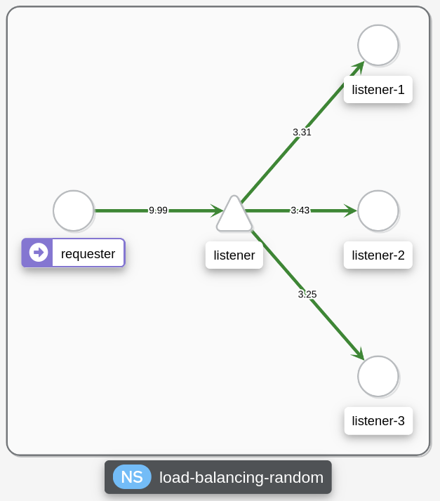
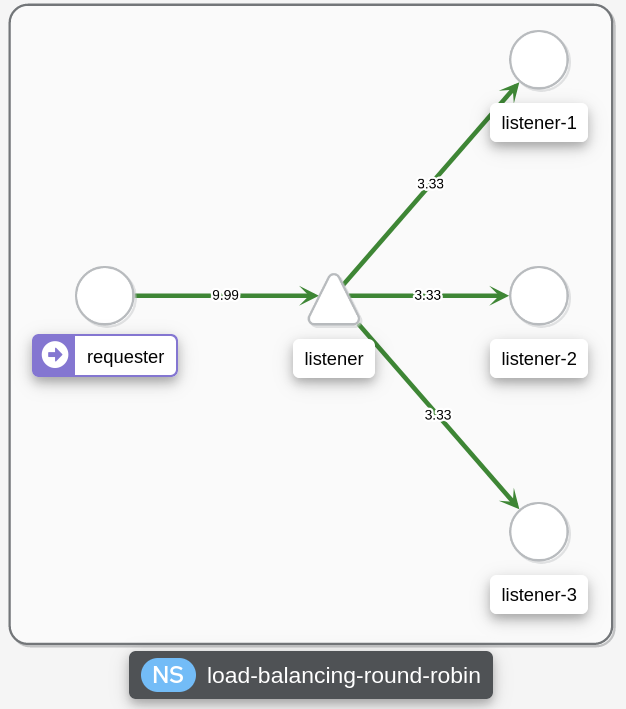

# Istio Load balancing

The goal here is to play with the load balancing capabilities of Istio

## Play with this toy

Simply `./play-with-this-toy.sh`

Don't forget to `./tidy-up.sh` your room once you are done !

## Some details

This sample does the following:
- create a k3d cluster
- install istio along with some conveniency tools (prometheus, grafana, kiali)
- deploy [this helm chart](./helm-chart) that contains the examples explained right below
- exposes [kiali](http://kiali.api-127.0.0.1.nip.io:8080/) and [grafana](http://grafana.api-127.0.0.1.nip.io:8080/) locally, so that we can "see" what is happening

## Samples

By opening [this url](http://kiali.api-127.0.0.1.nip.io:8080/kiali/console/graph/namespaces/?traffic=grpc%2CgrpcRequest%2Chttp%2ChttpRequest%2Ctcp%2CtcpSent&graphType=workload&namespaces=load-balancing-weighted-round-robin%2Cload-balancing-random%2Cload-balancing-round-robin&duration=60&refresh=15000&layout=dagre&edges=trafficRate&boxNamespace=true) you should land on a graph view of all the demonstrators (one per namespace) that are described below.

All samples are based on the same use case: a single `requester` instance makes 10 GET requests per second on a `listener` service, which is baked by 3 `listener` Pods (listener-1, listener-2, and yes I know you know, listener-3).
What changes between the various samples is simply the istio configuration, more specifically two things:
- The `listener DestinationRule` : this is where the load balancing strategy is set. Samples try various values of this setting
- The `listener VirtualService` : this is where the traffic shifting occurs. You can basically do anything here : add/remove destinations according to your criterions, weight the traffic,... Here again, the samples use some variations on those settings.

> Why do I use `Pods` and not a `Deployment` ? Because I wanted to be able to "see" the traffic flowing to each pod, and when you use a `Deployment`, Kiali aggregates the metric and only displays one box (so you dont see any load balancing happening in Kiali, which is very sad).

Samples:
- **Random Load Balancing** : The `load-balancing-random` namespace is a demonstrator where all 3 listeners receive the same share of traffic (1/3 each), and the load balancing is done with a `random` strategy. You should observe some inconsistencies in the traffic rates (it may not be perfectly 3.33 RPS
  
  
- **Round Robin Load Balancing** : The `load-balancing-round-robin` namespace is the same as before, but the load balancing is done with a `round robin` strategy. You should observe almost perfect traffic rates (very close to 3.33 RPS)
  
  
- **Weighted Round Robin Load Balancing** : The `load-balancing-weighted-round-robin` namespace is the same as the previous one, with the addition of weights for each listener traffic share (respectively 20%, 30% and 50%). Logically, you should observe numbers very close to 2 RPS for listener-1, 3 RPS for listener-2, and 5 RPS for listener-3
  
  

### Key takeaways

- :warning: for traffic shifting, [protocol selection](https://istio.io/latest/docs/ops/configuration/traffic-management/protocol-selection/) is a thing that may hurt you ! Properly name your service ports or the routing will not work !
- DestinationRule is in charge of load balancing strategy and subsets. Subsets are useless with only this resource, but hey, it is described here, live with it !
- Virtual Service is in charge of both routing and describing weights on routes. Subsets can be used to describe routing destinations
